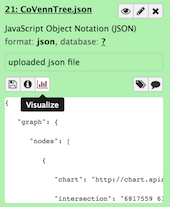
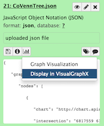
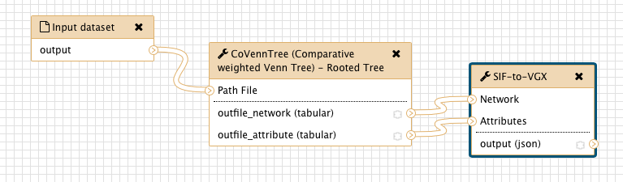
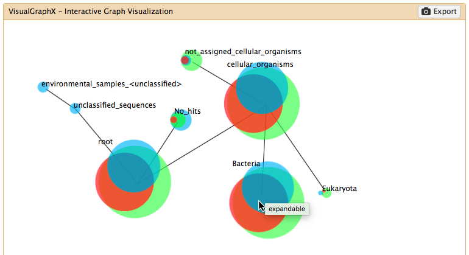

# VisualGraphX - 0.0.2

## About
We developed VisualGraphX, a web-based visualization tool for large-scale graphs. 
Current graph visualization tools that follow the rich-internet paradigm lack an interactive 
and scalable visualization of graph-based data. VisualGraphX aims to provide a 
universal graph visualization tool that empowers the users to efficiently explore the data 
for themselves at a large scale. It has been incorporated into the galaxy platform as an 
visualization plugin that is directly accessible through the User History.

## Install
**Important:** Installation of VisualGraphX has to be done by the administrator of the Galaxy instance. 

1. Visualizations in Galaxy are located in the folder `/config/plugins/visualizations/` that 
needs to be specified in `/config/galaxy.ini` at `visualization_plugins_directory`. VisualGraphX 
needs to be located in this folder in order to be loaded on Galaxy startup. More information
can be found at the [Visualizations Registry](https://wiki.galaxyproject.org/VisualizationsRegistry) 
in the official Galaxy documentation. VisualGraphX can be installed to the desired folder by cloning 
the Gitlab repository with the git command `git-clone`. Assuming your galaxy instance resides in `/opt/galaxy` the following should work:
`cd /opt/galaxy/config/plugins/visualizations/`
`git clone https://gitlab.com/comptrans/VisualGraphX.git`

2. Next, some files need to be copied to the correct locations within the Galaxy directory hierarchy. To automate this we provide a gruntfile (`gruntfile.js`) to configure [GRUNT](http://gruntjs.com/). GRUNT is a generic task runner for the JavaScript runtime environment 
[Node.js](https://nodejs.org) to streamline repetitive tasks and can be installed through the 
[Node.js package manager (npm)](https://www.npmjs.com/). Download the Node.js distribution (which already includes npm) for your platform from [nodejs.org](https://nodejs.org/en/download/) and follow the accompanying installation instructions. Installation of GRUNT is then as easy as executing the following command:
```
npm install -g grunt-cli
```
In case of any problems during installation you should check the offcial [GRUNT documentation](http://gruntjs.com/getting-started). 

3. At first, install the dependencies that are specified in the `package.json` with the command `npm install`. Next, modify the path to Galaxy by editing line 7 in `gruntfile.js`, such that it points to your galaxy instance. For example if your galaxy instance resides in `/opt/galaxy`, the head of the gruntfile should look like this:

```
1 /* Gruntfile.js for correct setup of visualgraphx and its integration into galaxy. Usable for active development. */
2 module.exports = function(grunt) {
3 
4     grunt.initConfig({
5         options: {
6             // path of galaxy instance
7             galaxy: '/opt/galaxy/',  // <-- PUT THE PATH TO YOUR GALAXY INSTANCE HERE!
8             // path of galaxy config
9             galaxyconfig: '../galaxyconfig/'
10        },
```
This ensures that VisualGraphX is copied into the correct folder. Type `grunt` in the command line to
initiate the copy process. Finally, restart Galaxy to load VisualGraphX.

## Implementation
VisualGraphX has been written in JavaScript and utilizes the d3.js library for the interactive graph 
visualization. It implements the Model-View-Controller concept by usage of the Backbone.js library.
Furthermore, DefiantJS allows the efficient search of large JSON files using XPath expressions.

## Usage
VisualGraphX comes with the required files for its integration into the Galaxy Visualization Registry.
Select a JSON dataset from the history panel and click on the Visualize icon  and select `Display in VisualGraphX` as shown below:

 

Now, the configuration panel appears in which one can adjust the parameters for the graph visualization. Details about these can be found in the description below the parameters.
Clicking on `Visualize` initiates the visualization. Finally, the `Export` allows to export the graph
either as scalable vector graphics (SVG) or portable network graphics (PNG). 

## Workflow

We demonstrate VisualGraphX as part of the analysis workflow with CoVennTree, see [S.C. Lott et al., 2015](http://journal.frontiersin.org/article/10.3389/fgene.2015.00043/full) for more information. Just as with the SIF-to-JGF converter, CoVennTree can be directly installed through the Galaxy Tool Shed
(repository: covenntree). The workflow of the comparative analysis with CoVennTree includes the following steps:

1. Transformation of the input path file with CoVennTree, which produces two new files. One file includes the entire network of the tree (network.sif) 
and the second one contains the attributes (attribute.venn) to describe every node. 
2. Conversion of the network and attributes file into a JSON Graph Format (JGF) with SIF-to-JGF.
3. Visualization with VisualGraphX.

We provide `/sample data/CoVennTree_path.txt` that is an input path file for CoVennTree. 
It corresponds to the processed 16S rDNA datasets as discussed
in S.C. Lott et al., 2015. CoVennTree transforms the input path file into the `Network` and 
`Attributes` files that we have deployed at `/sample data/CoVennTree_network.sif` and `/sample data/CoVennTree_attributes.venn`. **Important:** The `transformation` function needs to fit the data, 
otherwise the diagrams will be scaled too high and cannot be visualized. In this example it needs to be specified at `datasets max: 3,000,000 data points in sum`. Lastly, conversion of the files into the 
JSON Graph Format (JGF) with SIF-to-JGF allows the visualization with VisualGraphX. **Important:** As CoVennTree creates a `Network` (.sif) file in space delimited format, it is mandatory to set the parameter `space-delimited` when converting to .jgf. We prepared the Galaxy workflow at `/sample data/CoVennTree_workflow.ga` that can be incorporated in any Galaxy instance and is shown below:



Upon conversion of the `Network` and `Attributes` file into a valid JSON Graph Format (JGF) file, the
visualization with VisualGraphX as described above. In the `Settings` the parameter `Source` needs to 
set to `external`. Other parameters are arbitrary. The following shows the initial visualization with 
the default parameters.



Hovering over the nodes at the maximum depth of the graph will indicate via tooltip (`expandable`) if there are adjacent nodes that can be added to the graph. In the figure above, the node `Bacteria` can 
be expanded. Similarly, for any node that is inside of the graph all the way to the root node can be collapsed (e.g., `cellular_organisms` in this example). Nodes can be expanded/collapsed through double click on the nodes. Other types of interaction include click and drag the nodes to move and pin them to a desired location. Similarly, a right click unpins the node. 

## File Format
The [JSON (JavaScript Object Notation) Graph Format (JGF)](https://github.com/jsongraph/json-graph-specification) 
is the supported input file format. Both single and multigraph files can be specified. In its most minimal form it
requires arrays for both the `nodes` and the `edges` encapsulated in the `graph` object. In the case of multiple 
graphs the (graph) objects are gathered in the `graphs` array. 

```javascript
{
    "graph": {
        "nodes": [
            {
                "id": "A",
            },
            {
                "id": "B",
            }
        ],
        "edges": [
            {
                "source": "A",
                "target": "B"
            }
        ]
    }
}
```

In particular, `nodes` contains objects that correspond to the nodes in the graph with arbitraty attributes. However, the objects have to include the attribute `id` whose value needs to be unique 
among the objects. Its value is defined as string for high flexibility. Other attributes that can be 
included in the visualization are the node label (`name`), and URL of external graphic (`chart`), but 
need to be located in the `metadata` subobject. Similarly, the `links` array contains objects that 
correspond
to the links/edges in the graph with the attributes `source` and `target` whose values are the id's 
defined in the node objects. 

## Conversion from SIF to JSON Graph Format (JGF)
VisualGraphX aims to be a generic approach for the visualization of graphs. Therefore, we provide a converter for Galaxy that takes as input a simple interaction format (SIF) file with an optional attributes list in tabular format and converts it to a JSON file in the JGF format. It can be installed directly through the [Galaxy Tool Shed](https://toolshed.g2.bx.psu.edu/repository?repository_id=15a6add958eae279&changeset_revision=2faeb500052d) (repository: vgx_converter). Data from [CBN](http://www.causalbionet.com) can be exported as SIF file and visualized with VisualGraphX when being converted to JGF.  


## Data
We provide several example data that can be used with VisualGraphX and can be found under the `sample data` directory. `/sample data/CoVennTree.jgf` is a dataset that results from analysis with [CoVennTree](https://toolshed.g2.bx.psu.edu/view/steffen/covenntree/745aede829e9) (`/sample data/CoVennTree_attributes.venn`, `/sample data/CoVennTree_network.sif`) and further conversion with SIF-to-JGF as explained above. It was originally described in [Steglich et. al (2014)](http://www.ncbi.nlm.nih.gov/pubmed/25450165/). Furthermore, the angiogenesis network that has been exported from the [Causal Biological Network Database](http://www.causalbionet.com) to illustrate the general applicability of VisualGraphX. It can be found at `/sample data/angiogenesis.jgf`. Similarly, the apoptosis and calcium networks can be found at `/sample data/Apoptosis2.0.jgf` and `/sample data/Calcium1.1.jgf` respectively. Additionally, `/sample data/mTOR_ChEMBL.sif` and `/sample data/mTOR_ChEMBL.json`is a network that has been exported from [ChEMBL](https://www.ebi.ac.uk/chembl/) in Cytoscape and consists of 4692 nodes with 7688 edges. For the illustration of the difference between single and multiple graphs in JGF, a most minimal multigraph file
has been deployed (`sample data/multigraph_min.jgf`). Lastly, `/sample data/100Knetwork.jgf` is an artificially created network that consists of 100000 nodes and 100000 edges to demonstrate the large-scale applicability of VisualGraphX. It can be found at `/sample data/100Knetwork.jgf`.


## Troubleshooting
As a first measure, ensure that Galaxy loaded VisualGraphX successfully. Check the logile of Galaxy 
and search for the lines that start with `galaxy.web.base.pluginframework`. Make sure that VisualGraphX
is among the loaded plugins. There should be a line similar to the following:

```
galaxy.web.base.pluginframework INFO 2016-02-15 10:56:22,177 VisualizationsRegistry, loaded plugin: VisualGraphX
```

If there is an error message, it should look similar to this:

```
galaxy.web.base.pluginframework WARNING 2016-02-15 10:56:22,177 VisualizationsRegistry, plugin load failed or disabled:
./config/plugins/visualizations/VisualGraphX. Skipping...
```

If VisualGraphX has been loaded but still fails to start when selecting `VisualGraphX` on the `Visualize`
icon on the history panel then enable the debugging output. Change to the VisualGraphX directory in 
the `./config/plugin/visualization/` and comment the first two lines of `./static/app.js`. 

```javascriopt
//window.console.debug = function() {};
//window.console.log = function() {};
```

Now, select `VisualGraphX` over the `Visualize` icon and open the the console in chrome or firefox and
create a new issue and paste the output of the console. 

## Requirements
VisualGraphX has been tested and developed with Google Chrome (Version 50) and Firefox (Version 45)
and works in its recent versions. 


### Note 
Make sure that Galaxy recognizes the input file as JSON, otherwise it cannot be visualized.

